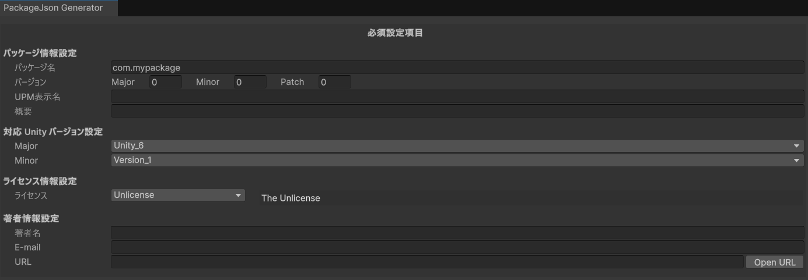
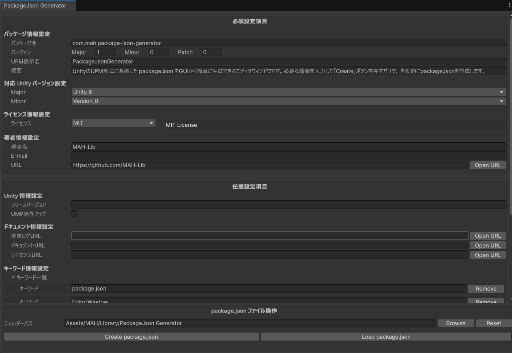

# Unity-PackageJsonGenerator
Unityの UPM (Unity Package Manager) 対応パッケージを公開する際に必要な package.json ファイルを、簡単に生成できる Editor 拡張ツールです。

## 対応バージョン

- 6000.0.0以上

## インストール方法

#### UPM Package

1.Git URLをコピー
```
https://github.com/MAH-Lib/Unity-PackageJsonGenerator.git?path=PackageJsonGenerator
```
2.Unity Package Manager から `...form git URL`を選択

3.`Install package form git url`の欄にコピーしたGit URLをペーストしインストールを行う

#### manifest.json

`Packages/manifest.json` に以下を追加してください。  
```
"com.mah.package-json-generator":"https://github.com/MAH-Lib/Unity-PackageJsonGenerator.git?path=PackageJsonGenerator"
```

<!-- 必要な場合に記述 --> 
## 使用方法
1. メニューバーから MAH/Generator/PackageJson Generator Window を選択

   

2. 表示されたEidtor Window に必要な情報を入力

   - **必須設定項目**  
     必ず入力する必要のある項目です  
     ※著者情報設定の [E-mail] [URL] は入力不要です
     
     

   - **任意設定項目**  
     設定する項目のみ入力します

     

3. [Browes] をクリックし package.json を生成するフォルダーを選択

   
   
4. [Create package.json] をクリックし package.jsonファイルを生成

   

## サポート・投稿先について

- **バグ報告・機能追加の要望** → [Issues](../../issues)
- **質問・相談・意見交換** → [Discussions](../../discussions)

ご協力ありがとうございます！

## License
see [LICENSE](LICENSE)
